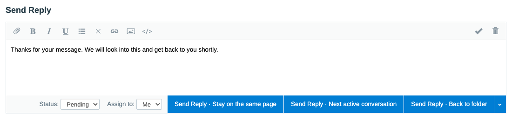
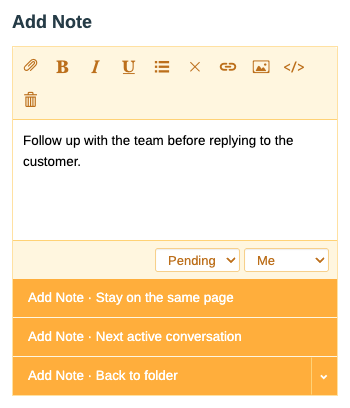
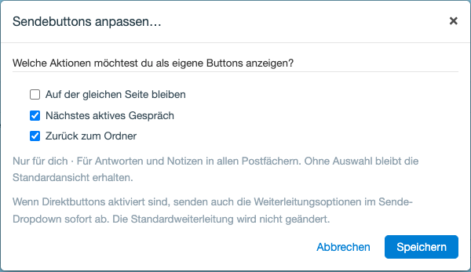

# Send Actions

A minimal FreeScout module adding per-user direct send buttons to existing conversation replies and notes. No core modifications, migrations, routes, build step, or extra dependencies.

## Screenshots

English editor previews with all three actions enabled, rendered using FreeScout's editor and the module's assets with sample content.

**Reply editor (desktop)**



**Note editor (mobile)**

The buttons fill the available width; the dropdown stays beside the last action.



**Send button settings (German)**

Opened from the send dropdown, rendered with FreeScout's modal and the module's assets.



## Installation and usage

Requires FreeScout **1.8.239** or newer.

Place this repository in `Modules/SendActions`, then activate **Send Actions** in FreeScout's Modules screen. In an existing conversation, open the send dropdown and choose **Customize send buttons…** (**Sendebuttons anpassen…** in German). Select your preferred actions in the modal and save. The buttons update immediately without reloading the page, changing your draft, or sending a message. Cancel leaves your preferences unchanged. The same selection applies to replies and notes in all mailboxes.

The settings remain available under **Your Profile → Send Reply / Add Note → After Sending** as well. The editor has no additional settings link outside the dropdown.

Selected actions replace the visible original send button with square-cornered direct buttons matching the core button height and typography. The complete dropdown remains available for other redirects: clicking a redirect option sends immediately when direct buttons are enabled. The original button remains hidden in the DOM to reuse the core send handler. With no actions selected, the original send controls and dropdown behavior are unchanged apart from the new settings entry. Unchecking every option restores those controls; the settings entry remains available.

Direct buttons set `after_send` for the current submission and invoke the original send handler, preserving validation, attachments, autosave waiting, module submission filters and double-send protection. They do not save a new default redirect. Keyboard send shortcuts continue to use the core behavior and current dropdown selection. New conversations, forwarding, phone creation and chat-mode editors keep their original controls.

Preferences use FreeScout's `options` table, with one `sendactions.user.<user ID>` entry per user who saves preferences. The modal uses FreeScout's authenticated, CSRF-protected user AJAX endpoint and only updates the signed-in user's preferences. Profile authorization is handled by FreeScout (including administrators editing another profile). Disabling the module leaves preferences stored for reactivation.

## GitHub updates

The module uses public assets from the latest stable [GitHub release](https://github.com/obstschale/freescout-send-actions/releases/latest). No access token or interactive login is needed once the release assets have been published.

The following URLs are configured in `module.json`:

```json
{
    "latestVersionUrl": "https://github.com/obstschale/freescout-send-actions/releases/latest/download/module.json",
    "latestVersionZipUrl": "https://github.com/obstschale/freescout-send-actions/releases/latest/download/SendActions.zip"
}
```

FreeScout reads the version from the release's `module.json` and downloads its matching `SendActions.zip`. Using release assets instead of `main` avoids advertising unreleased changes. The ZIP must contain a `SendActions/` root directory; GitHub's automatic source archive uses the repository name instead and does not match the installed module directory.

Each stable release must publish both assets from the same tagged commit. The URLs return 404 until the first release with these assets is published. Prepare the ZIP with `git archive --format=zip --prefix=SendActions/ --output=SendActions.zip <tag>` outside the working tree, and upload it together with that tag's `module.json`.

## Maintenance

Integration points: `user.edit.before_photo`, `user.save_profile`, `users.ajax.response_default`, `conversation.append_send_dropdown`, `conv_editor.editor_toolbar_prepend`, `conv_editor_init`, `javascripts`, and `stylesheets`. The modal reuses `showModal` and `fsAjax`. Recheck `.note-statusbar`, `.btn-group-send`, `.btn-reply-submit`, and the core send handler after FreeScout upgrades.

Run `php Modules/SendActions/Tests/check.php` from the FreeScout root to check preferences, AJAX user isolation, opt-out, dropdown visibility, and rendered Blade views using an isolated in-memory SQLite database. Requires the host's Composer dependencies and PHP SQLite extension; it does not boot the installed application or change its data. Check JavaScript syntax with `node --check Modules/SendActions/Public/js/module.js`.

For browser regression checks, cover opening the modal before any actions are configured, saving a subset, reopening, cancelling changes, and clearing all choices. Verify that the draft, status, assignee, and `after_send` are unchanged and that no send handler runs when configuring. Check network-error retry, repeated save clicks, keyboard focus after closing, and narrow-screen layout. The settings entry must stay hidden in forwarding and phone mode; direct sends must still use the original reply or note handler.

## License

Licensed under the [GNU Affero General Public License, version 3 only](LICENSE) (`AGPL-3.0-only`).
